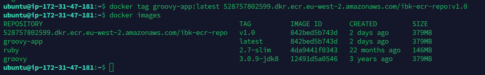

# **GitHub Documentation: Building and Deploying a Docker Image Using Jenkins Pipeline**

This documentation provides a step-by-step guide to build a Docker image using Docker BuildKit from the [hellogitworld](https://github.com/IbkWilliams1/hellogitworld.git) repository, create a Jenkins pipeline, and push the image to Docker Hub and AWS Elastic Container Registry (ECR).

---

## **Prerequisites**

Before starting, ensure the following are installed and configured:

1. **Docker**: Installed and running with **BuildKit** enabled.
2. **Jenkins**: Installed and running with the necessary plugins (e.g., Docker Pipeline, AWS ECR).
3. **Docker Hub Account**: A Docker Hub account to push the image.
4. **AWS Account**: An AWS account with ECR access and credentials configured on Jenkins.
5. **Git**: Installed on your local machine.

---

## **Step 1: Install and Enable Docker BuildKit**

### **Install Docker BuildKit**
If your system does not have Docker BuildKit or its `buildx` plugin installed:

1. Ensure Docker is installed. Use the following commands for a fresh installation:
   ```bash
   sudo apt-get update
   sudo apt-get install \
       docker-ce \
       docker-ce-cli \
       containerd.io \
       docker-buildx-plugin
   ```

   For specific installation instructions based on your operating system, refer to [Docker's Official Documentation](https://docs.docker.com/get-docker/).

2. Verify BuildKit Installation:
   ```bash
   docker buildx version
   ```

### **Enable Docker BuildKit**
BuildKit is not enabled by default. To enable it:

1. Set the environment variable for BuildKit:
   ```bash
   export DOCKER_BUILDKIT=1
   ```

2. Add this to your shell configuration file (e.g., `.bashrc` or `.zshrc`) for persistence:
   ```bash
   echo "export DOCKER_BUILDKIT=1" >> ~/.bashrc
   source ~/.bashrc
   ```

### **Verify Docker Daemon**
Ensure the Docker daemon is running:
```bash
sudo systemctl start docker
sudo systemctl enable docker
```

---

## **Step 2: Clone the Repository**

1. Open a terminal and clone the hellogitworld repository:
   ```bash
   git clone https://github.com/IbkWilliams1/hellogitworld.git
   cd hellogitworld
   ```

2. Verify the contents of the repository:
   ```bash
   ls
   ```

---

## **Step 3: Create a Dockerfile**

1. In the root of the repository, create a `Dockerfile` optimized for BuildKit:

   ```dockerfile
   # Use an official Groovy image with JDK
   FROM groovy:3.0.9-jdk8

   # Set the working directory inside the container
   WORKDIR /app

   # Copy all files and set permissions in one step
   COPY --chmod=0755 runme.sh ./runme.sh
   COPY . .

   # Expose a port (if applicable; adjust if required)
   EXPOSE 8080

   # Specify the script to execute when the container runs
   CMD ["sh", "./runme.sh"]
   ```

2. This Dockerfile uses BuildKit's `--chmod` feature to set permissions while copying files.

---

## **Step 4: Build and Run the Docker Image Locally**

1. Build the Docker image locally using BuildKit:
   ```bash
   DOCKER_BUILDKIT=1 docker build -t groovy-app .
   ```

2. Verify the image was built:
   ```bash
   docker images
   ```


3. Run the container locally to test:
   ```bash
   docker run -- name my-container -dt -p 80:80 groovy-app:latest
   ```


4. Open your browser and navigate to `http://localhost:80` to verify the application is running.

---
#### Before automate the whole process with Jenkins, Let's do the manual push of the image to ECR.

* "A Step-by-Step Guide to Pushing Docker Images to Amazon ECR Using Docker CLI and AWS CLI Without Jenkins"

---

### Step-by-Step Guide to Pushing Docker Images to Amazon ECR

*Prerequisites:*

1. *AWS Account*: You must have an AWS account.
2. *AWS CLI*: Make sure the AWS CLI is installed and configured on your local machine.
3. *Docker*: Docker should be installed on your machine.
4. *IAM Permissions*: Ensure your IAM user has the necessary permissions to interact with Amazon ECR. Policies like AmazonEC2ContainerRegistryFullAccess are typically required.

### Step 1: Configure AWS CLI

1. Open your terminal or command prompt.
2. Configure the AWS CLI with your AWS credentials:
   bash
   aws configure
   
3. You will need to enter your:
   - AWS Access Key ID
   - AWS Secret Access Key
   - Default region name (e.g., us-east-1)
   - Default output format (e.g., json)

### Step 2: Create an ECR Repository

1. Use the AWS CLI to create a new ECR repository. Replace your-repo-name with your desired repository name.
   bash
   aws ecr create-repository --repository-name your-repo-name
```bash
aws ecr create-repository --repository-name ibk-ecr-repo
``` 

2. Note down the repository URI returned in the output (it will look like 123456789012.dkr.ecr.us-east-1.amazonaws.com/your-repo-name).

### Step 3: Authenticate Docker with ECR

1. Get the login command for Docker to authenticate with your Amazon ECR registry:
   ```bash
   aws ecr get-login-password --region your-region | docker login --username AWS --password-stdin 123456789012.dkr.ecr.your-region.amazonaws.com
   ```
   (Replace your-region and 123456789012 with your actual region and AWS account ID.)


### Step 4: Build Your Docker Image

1. Navigate to the directory containing your Dockerfile or your application code.
2. Build your Docker image. Replace your-image-name and your-tag as needed:
   bash
   docker build -t your-image-name:your-tag .
   

### Step 5: Tag Your Docker Image for ECR

1. Tag your Docker image to match your ECR repository format:
   ```bash
   docker tag your-image-name:your-tag 123456789012.dkr.ecr.your-region.amazonaws.com/your-repo-name:your-tag
   ```   
```bash
docker tag groovy-app:latest 528757802599.dkr.ecr.eu-west-2.amazonaws.com/ibk-ecr-repo:v1.0
```



### Step 6: Push the Docker Image to ECR

1. Now, push your Docker image to Amazon ECR like this:
   ```bash
   docker push 123456789012.dkr.ecr.your-region.amazonaws.com/your-repo-name:your-tag
   ```
   OR like this:
   ```bash
   docker push new-repository:your-new-tag
   ```
    
### Step 7: Verify the Image in ECR

1. You can verify that your image has been successfully pushed to the ECR repository either by running:
   
  ```bash
   aws ecr describe-images --repository-name your-repo-name
   ```
   
  This command will list the images in your ECR repository.
2. check the ECR repository on the GUI
   

### Conclusion

Congratulations! You have successfully pushed your Docker image to Amazon ECR using the Docker CLI and AWS CLI without utilizing Jenkins. You can now deploy your Docker image to other AWS services such as ECS or EKS.


## **Step 5: Create a Jenkinsfile**

1. In the root of the repository, create a `Jenkinsfile`:
   ```groovy
   pipeline {
       agent any

       environment {
           DOCKER_HUB_CREDENTIALS = credentials('docker-hub-credentials')
           AWS_ECR_CREDENTIALS = credentials('aws-ecr-credentials')
           DOCKER_IMAGE = 'hellogitworld'
           DOCKER_TAG = 'latest'
           AWS_ACCOUNT_ID = 'your-aws-account-id'
           AWS_REGION = 'your-aws-region'
           ECR_REPOSITORY = 'your-ecr-repo-name'
       }

       stages {
           stage('Build Docker Image') {
               steps {
                   script {
                       docker.build("${DOCKER_IMAGE}:${DOCKER_TAG}")
                   }
               }
           }

           stage('Push to Docker Hub') {
               steps {
                   script {
                       docker.withRegistry('https://registry.hub.docker.com', DOCKER_HUB_CREDENTIALS) {
                           docker.image("${DOCKER_IMAGE}:${DOCKER_TAG}").push()
                       }
                   }
               }
           }

           stage('Push to AWS ECR') {
               steps {
                   script {
                       docker.withRegistry("https://${AWS_ACCOUNT_ID}.dkr.ecr.${AWS_REGION}.amazonaws.com", AWS_ECR_CREDENTIALS) {
                           docker.image("${DOCKER_IMAGE}:${DOCKER_TAG}").push("${ECR_REPOSITORY}:${DOCKER_TAG}")
                       }
                   }
               }
           }
       }

       post {
           success {
               echo 'Docker image built and pushed successfully!'
           }
           failure {
               echo 'Pipeline failed. Check logs for details.'
           }
       }
   }
   ```

2. Replace the placeholders (`your-aws-account-id`, `your-aws-region`, `your-ecr-repo-name`) with your AWS account details.

---

## **Step 6: Configure Jenkins**

1. Open Jenkins and create a new pipeline job.
2. Configure the pipeline to use the Jenkinsfile from the repository:
   - Select "Pipeline script from SCM."
   - Set the SCM to Git and provide the repository URL: `https://github.com/IbkWilliams1/hellogitworld.git`.
3. Add credentials for Docker Hub and AWS ECR in Jenkins:
   - Go to *Credentials > System > Global credentials*.
   - Add a username-password credential for Docker Hub (`docker-hub-credentials`).
   - Add an AWS access key and secret key for ECR (`aws-ecr-credentials`).

---

## **Step 7: Run the Jenkins Pipeline**

1. Save the Jenkins job configuration.
2. Click **Build Now** to trigger the pipeline.
3. Monitor the pipeline logs to ensure the Docker image is built, pushed to Docker Hub, and uploaded to AWS ECR.

---

## **Step 8: Verify the Deployment**

1. **Docker Hub**:
   - Log in to Docker Hub and verify the image is available in your repository.

2. **AWS ECR**:
   - Go to the AWS Management Console.
   - Navigate to ECR and verify the image is in the specified repository.

---

## **Troubleshooting**

- **Docker Build Fails**: Ensure BuildKit is enabled and the `Dockerfile` is correct.
- **Push to Docker Hub Fails**: Verify the credentials in Jenkins and ensure the Docker Hub repository exists.
- **Push to ECR Fails**: Check AWS credentials and ensure the ECR repository is created.

---

## **Conclusion**

You have successfully built a Docker image from the hellogitworld repository using Docker BuildKit, created a Jenkins pipeline, and pushed the image to Docker Hub and AWS ECR. This pipeline is extensible for additional stages like testing or Kubernetes deployments. 

For further customization, refer to the [Jenkins Pipeline Documentation](https://www.jenkins.io/doc/book/pipeline/) and [Docker BuildKit Documentation](https://docs.docker.com/develop/develop-images/build_enhancements/).

---